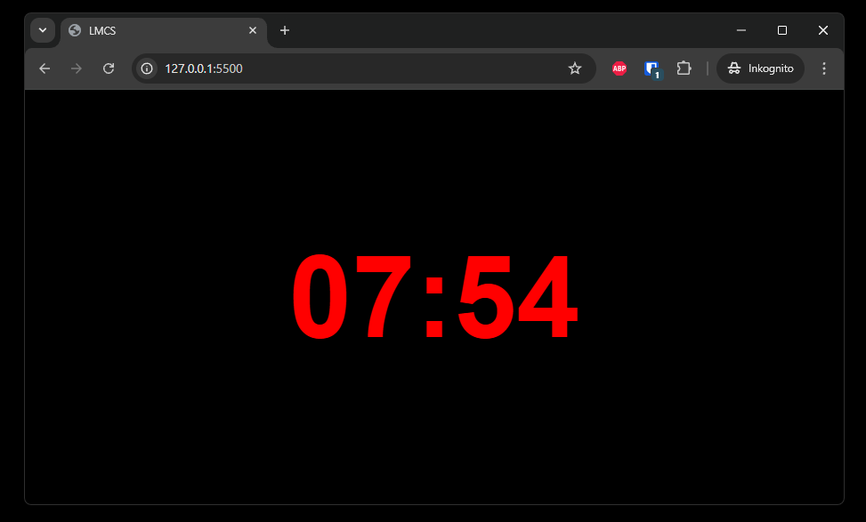
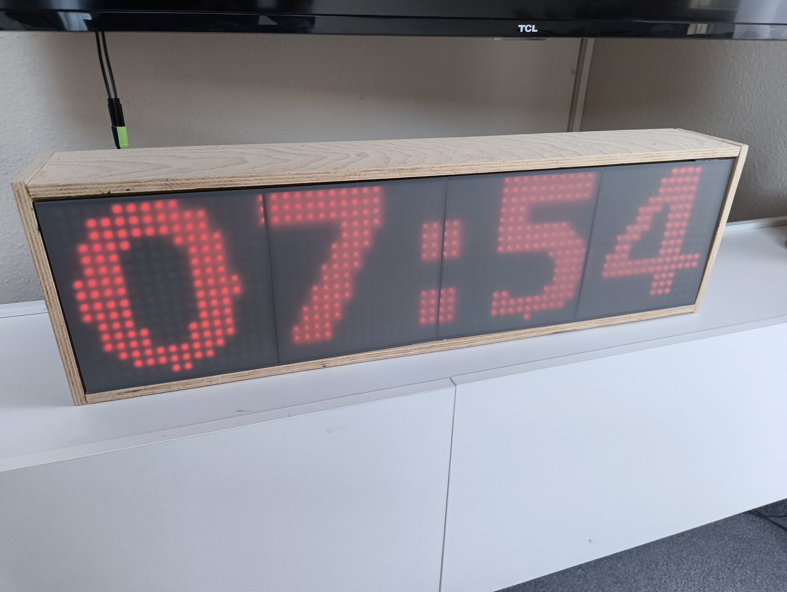

# LMCS - LED Matrix Control System

Ein Python-basiertes System zur Anzeige von dynamischen Webinhalten auf einer WLED LED-Matrix.

## Funktionsweise

Das System rendert eine HTML-Seite (z.B. eine Uhr) in einem headless Chrome-Browser, erstellt davon einen Screenshot und überträgt diesen auf eine 64x16 LED-Matrix via WLED.

```
HTML-Seite → Screenshot (Selenium) → Bild skalieren (PIL) → WLED Matrix (HTTP API)
```

## Hardware-Setup

- **LED-Matrix**: 4x WS2812B Matrizen (8x32) im 2x2 Block-Layout = 64x16 LEDs
- **Controller**: ESP32 mit WLED Firmware
- **Layout**:
  ```
  [Matrix 2][Matrix 1]  (oben)
  [Matrix 3][Matrix 0]  (unten)
  ```

## Features

- 🖥️ Rendert beliebige HTML-Inhalte auf LED-Matrix
- 🔄 Kontinuierlicher Loop-Modus mit konfigurierbarem Intervall
- 🐳 Docker-Support für einfaches Deployment
- ⚡ Vertikale Serpentine-Verkabelung automatisch unterstützt

## Installation

### Lokal
```bash
pip install -r requirements.txt
```

### Docker
```bash
docker-compose up -d
```

## Verwendung

**Einmalige Ausführung:**
```bash
python script.py
```

**Loop-Modus (Standard: 1 Sekunde):**
```bash
python script.py --loop
```

**Mit angepasstem Intervall:**
```bash
python script.py --loop --interval 5
```

## Konfiguration

| Parameter | Beschreibung | Standard |
|-----------|-------------|----------|
| `--loop`, `-l` | Kontinuierlicher Update-Modus | `False` |
| `--interval`, `-i` | Aktualisierungsintervall (Sekunden) | `1.0` |
| WLED IP | IP-Adresse des WLED Controllers | `10.0.0.221` |

## Beispiel

### HTML Screenshot


### WLED Ausgabe


## Abhängigkeiten

- `selenium` - Browser-Automatisierung
- `pillow` - Bildverarbeitung
- `requests` - HTTP-Kommunikation mit WLED
- `numpy` - Framebuffer-Verarbeitung
